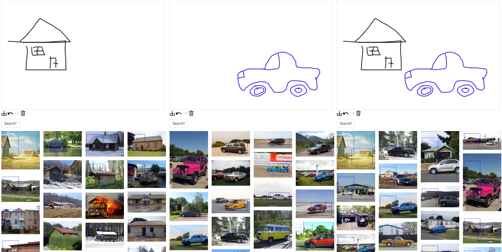

# Compositional Sketch Search

Official repository for ICIP 2021 Paper: [Compositional Sketch Search](https://arxiv.org/abs/2106.08009)

## Requirements
Install and activate conda environment
```commandline
conda env create -f env.yml
conda activate compsketch
cd src
```
If you're having trouble with installation, try changing `faiss-gpu` to `faiss-cpu` in `env.yml`.
## Indexing
Either download faiss index for OpenImages or Unsplash indexes
[here](https://drive.google.com/drive/folders/12NY_BRNxF5ZpxB7wW8bl4_uXbv1LiHz-?usp=sharing) and place them in `indexes/` or index your own dataset like so:
```commandline
python indexing.py --root PathToImages --name IndexName 
```

## Searching
Run the streamlit app
```commandline
streamlit run streamlit_app.py
```
If you are using a custom dataset:
- Pick 'Custom' in the Dataset selection box.
- Pick index file in the second selection box.
- Paste the same dataset root you used during indexing.

Sketch objects, using one colour per object.
Press "Search" to see results!

## Troubleshooting
On a Mac, I had to run this command to make it work
```bash
export KMP_DUPLICATE_LIB_OK=TRUE
```
